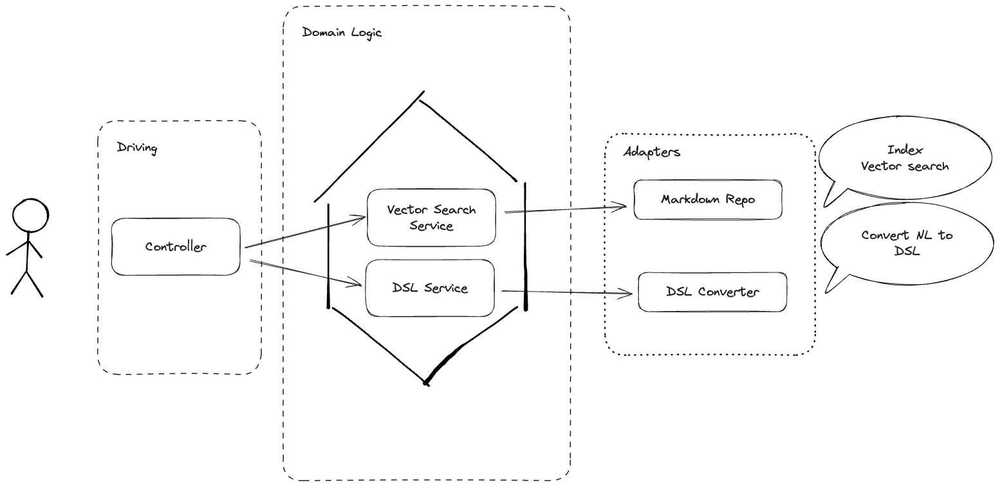

## Initial Design

- FastAPI for building the API endpoints.
- LangChain Structure Output (+ LLM) for Nature Language to DSL.
  - Regex DSL Converter was considered as well, but LLM in this case is more flexible, especially in this case for markdown vector search.
- sentence-transformers for embeddings markdown files. (or TF-IDF to make it simpler)
  - Used TF-IDF in the end, 1, simpler and lighter, 2 it meets most of the requirements. 

Input
- Nature Language Query

Output
- Similar Score and Reference Text
- DSL (Domain Specific Language) for the query (this is not required, but more for demonstration purposes)

Adapters / Outbound Ports
- SourceRepositoryPort (An interface for the repository to handle content splitting, embedding and matching)
  - Adapter Implementation: `markdown_repository.py` (For markdown file specifically, actually it can be used for any text file, but this is just a sample implementation)
- DSLConverterPort (An interface for converting natural language to DSL)
  - Adapter Implementation: `llm_query_controller.py` (For converting natural language to DSL and handling the query through LLM)
    - As mentioned above, this approach could be replaced with other implementation or other models. 

- Adapter(Driving)  (A Query Controller provide API endpoint following the INPUT)

### Project Structure

- domain
  - ports, for now, we just have two outcount ports
    - dls_converter_port.py
    - source_repository_port.py
  - services 
    - search_service.py
    - dsl_service.py
- adapters, including both outbound adapters
  - driving (inbound)
    - query_controller.py
  - driving (outbound)
    - markdown_repository.py
    - llm_query_controller.py

- docs, for some documentation files